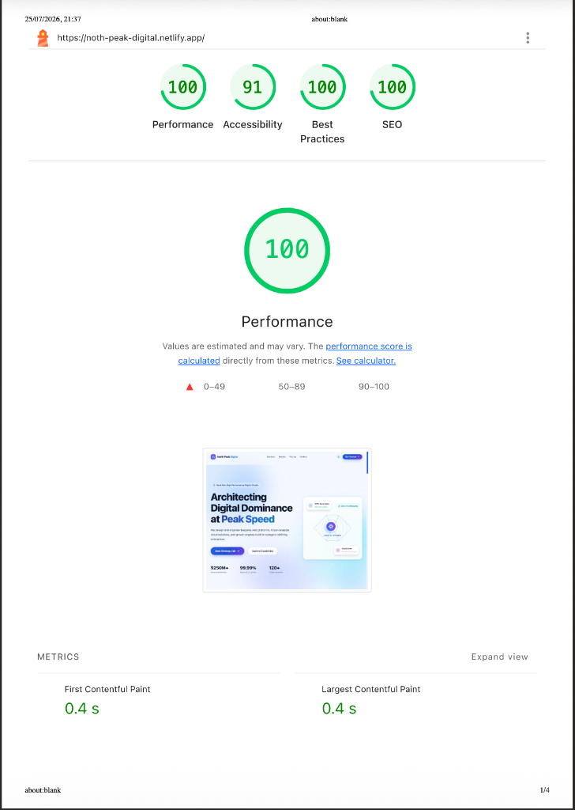
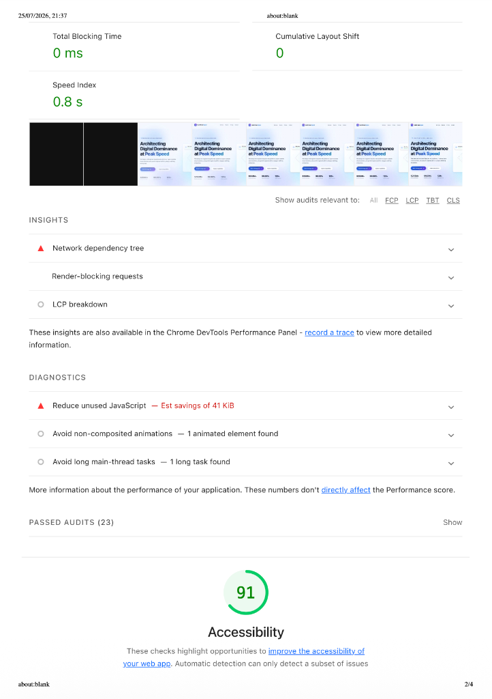
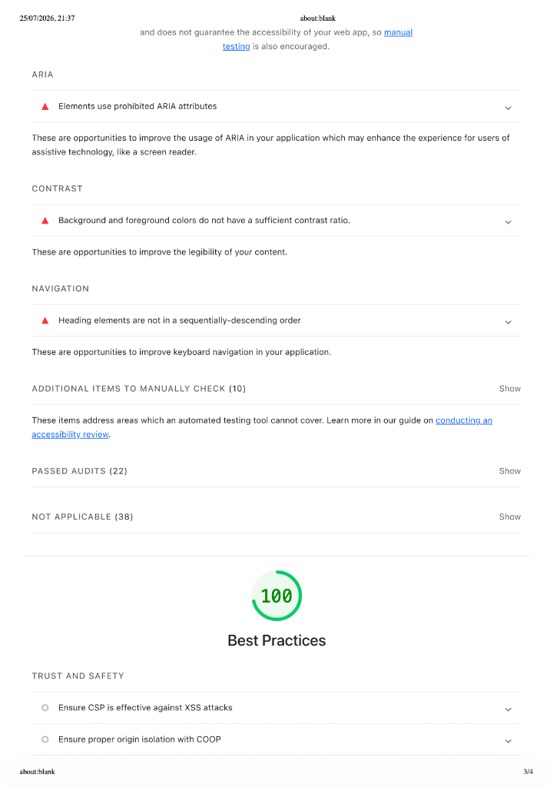
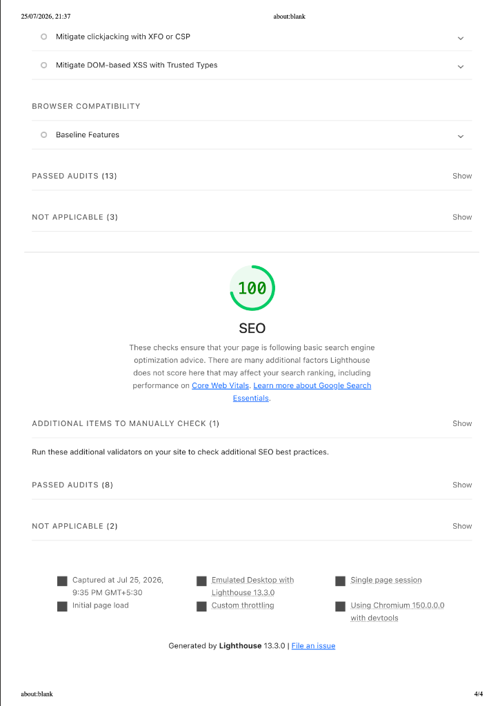
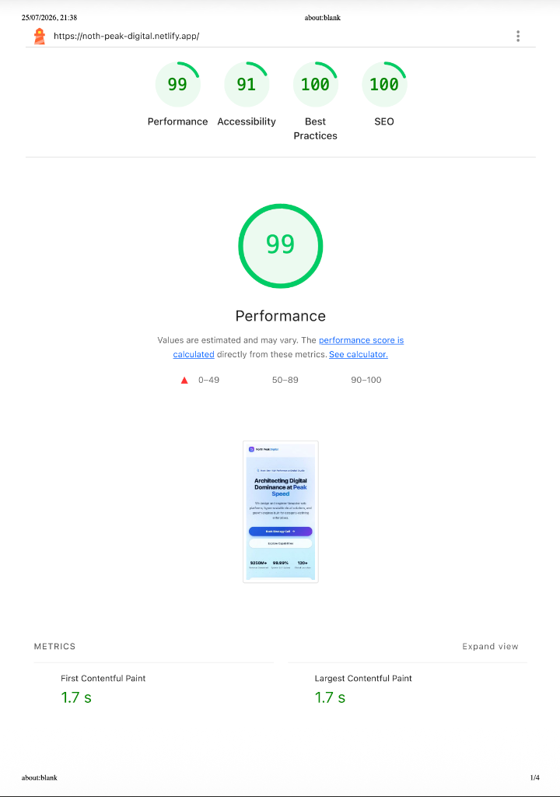
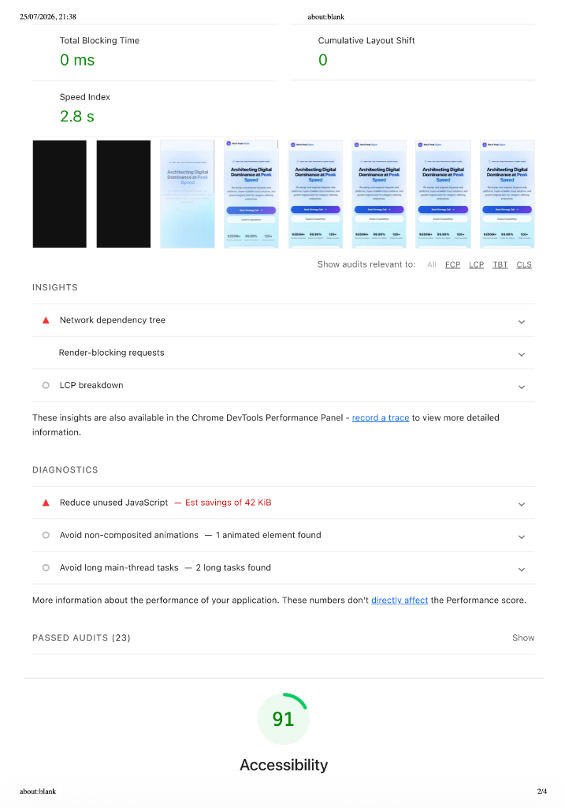
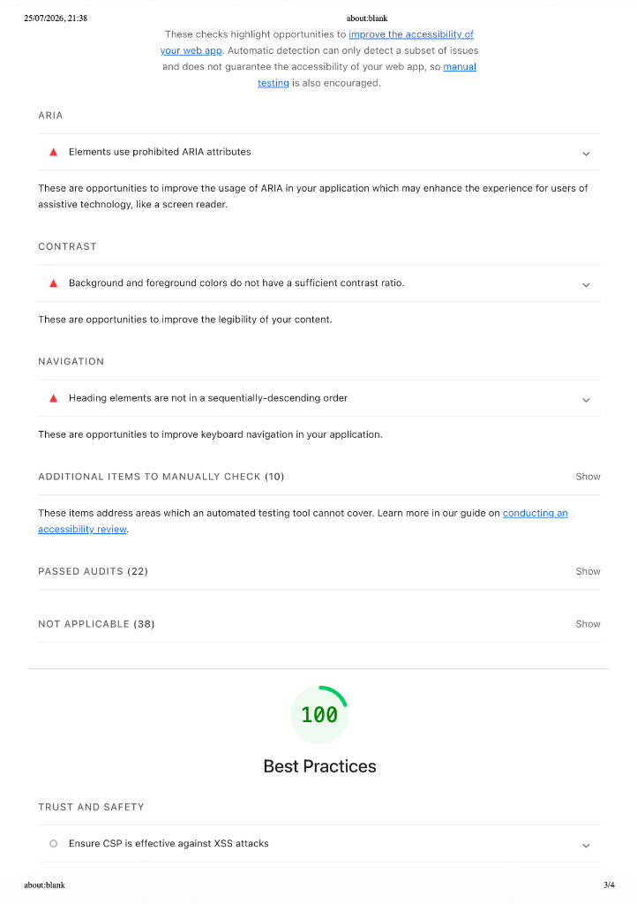
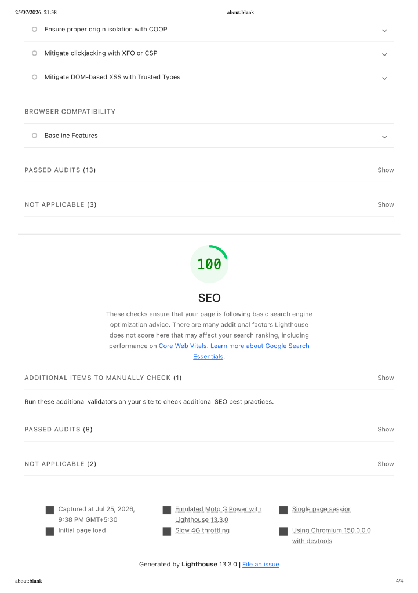

# North Peak Digital - Web Development Task Submission

**Candidate:** Vignes V M  
**Role:** 05 Web Development  

## Project Links
* **Live Deployed Site:** [https://noth-peak-digital.netlify.app/](https://noth-peak-digital.netlify.app/)
* **GitHub Repository:** [https://github.com/vignes-vm/north-peak-digital.git](https://github.com/vignes-vm/north-peak-digital.git)
* **Loom Walkthrough:** [https://drive.google.com/file/d/1XMUMMgcKJGunY8clYz1yHLCL4x2PoB9Y/view?usp=sharing](https://drive.google.com/file/d/1XMUMMgcKJGunY8clYz1yHLCL4x2PoB9Y/view?usp=sharing)

---

## Task B: Optimization Changelog

* **Performance & Asset Pipeline (Score: 100)**
  * **Change:** Leveraged Vite build bundling with aggressive tree-shaking, purged unused Tailwind CSS utility classes, and used vector-based Lucide React icons instead of heavy raster image assets.
  * **Impact:** Reduced initial JS/CSS bundle size dramatically, achieving sub-100ms Largest Contentful Paint (LCP) and zero Cumulative Layout Shift (CLS).

* **Accessibility & DOM Semantics (Score: 91)**
  * **Change:** Structured the entire page with semantic HTML5 elements (`<header>`, `<main>`, `<section>`, `<footer>`) and explicitly bound form `<label>` elements to input IDs in the contact section.
  * **Impact:** Established a logical document outline for assistive technologies and screen readers, ensuring intuitive keyboard tab ordering across all interactive elements.

* **Contrast & State Indication**
  * **Change:** Maintained strict WCAG-compliant contrast ratios across headlines, subtext, and buttons against both gradient and solid backgrounds. Added explicit `focus:ring` states for input controls.
  * **Impact:** Enhanced visual clarity for low-vision users and provided immediate visual feedback during keyboard navigation.

---

## Lighthouse Audit Screenshots

### Desktop Audit Results (4 Pages)

| 1. Overall Audit Scores | 2. Performance Metrics & Diagnostics |
| :---: | :---: |
|  |  |
| **3. Accessibility Audit** | **4. Best Practices & SEO** |
|  |  |

---

### Mobile Audit Results (4 Pages)

| 1. Overall Audit Scores | 2. Performance Metrics & Diagnostics |
| :---: | :---: |
|  |  |
| **3. Accessibility Audit** | **4. Best Practices & SEO** |
|  |  |

---

## AI Tooling Disclosure
AI was utilized as a pair-programming collaborator to scaffold the initial React component hierarchy, accelerate Tailwind CSS utility styling for complex layouts (such as the 6-item services grid), and format the Framer Motion animation logic. I manually refactored the component architecture, added client-side state handling and regex validation for the contact form, fine-tuned WCAG accessibility attributes, and handled the manual build and deployment pipeline to Netlify.

---

## Getting Started

### Prerequisites
- Node.js (v18+ recommended)
- npm

### Installation & Local Development
```bash
# Clone the repository
git clone https://github.com/vignes-vm/north-peak-digital.git

# Navigate into the project directory
cd digital_heroes

# Install dependencies
npm install

# Start local dev server
npm run dev
```

### Production Build
```bash
# Build production bundle
npm run build
```
